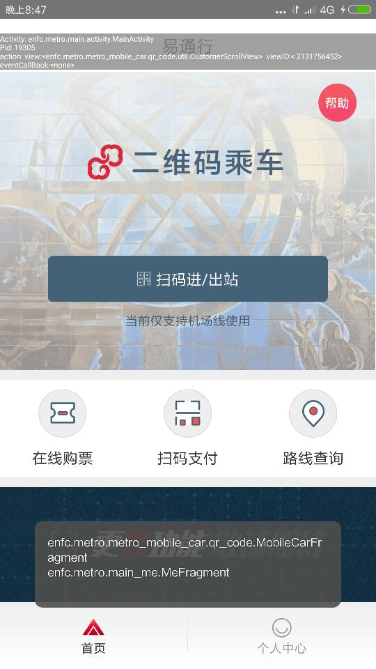
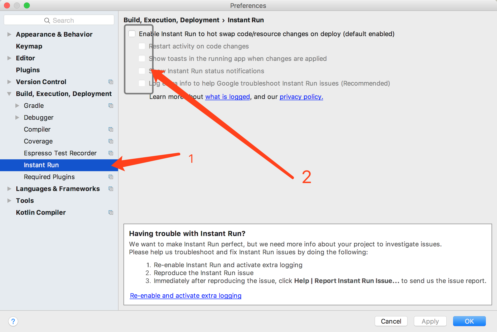

## hook base工具
Android 破解的hook工具，集成一些帮助破解的常用功能，如自动网络抓包、网络堆栈爆破、文件日志、webview调试环境

入口在 com.virjar.xposedhooktool.hotload.XposedInit,但是该入口代码非常不建议修改

1. 本工程是一个集成工程，包含一系列方便破解的工具，base工具不需要怎么修改，直接使用即可
2. 工具默认开启网络文件日志，因为破解拦截的业务日志可能非常大，使用xposed 本身的日志显示页面将会显示不够
3. 工具默认开启网络抓包，以及网络堆栈拦截。任何我们需要分析的数据，都会自网络传输出去，网络是所有逻辑必然流经的出口，拦截她可以方便分析逻辑，定位感兴趣的业务代码
4. 工具默认开启webview调试，webview调试功能可以实现对h5页面逻辑的分析爆破，请注意在低端机上面调试功能可能不好用，建议在宿主机5.0以上使用。webview调试环境配置请自行问度娘。
5. 工具系统了新的插件加载入口，用来实现插件代码热加载功能，非常不建议在/assets/xposed_init里面添加新的xposed钩子函数，这里的钩子函数需要安装后重启才能生效。
6. 工具默认启用了DroidSword，DroidSword是一个界面元素定位模块，可以通过touch view元素的方式，获取view的类型、事件回调、activity、fragment信息，便于自顶向下分析逻辑入口

## 关于热加载
本工具环境绕过了xposed插件更新需要重启Android设备的限制，关于xposed热加载网上有一些方案：
如:https://github.com/githubwing/HotXposed 和 https://github.com/liuyufei/hotposed 但是我觉得这两个都有一些不方便的地方，而且还存在权限的风险（她们都借助sdcard和热发代码通信，但是宿主进程可能没有sdcard权限，这样加载热发代码会报错）
她们都需要双apk配合，用来隔离插件和基座，第二个还需要删除原插件xposed入口，使插件变成热加载插件的插件

### 关于我们的热加载
使用我们这个热加载没有这么麻烦，hotload模块的设计和xposed本身类似。只需要在/assets/hotload_entry.txt中配置入口，即可正常实现热加载。
hotload模块实现类不再是de.robv.android.xposed.IXposedHookLoadPackage，为了避免混淆，我提供了新的入口com.virjar.xposedhooktool.hotload.XposedHotLoadCallBack，当然xposed原始代码很容易迁移。因为参数在com.virjar.xposedhooktool.hotload.SharedObject都有
com.virjar.xposedhooktool.hotload.XposedHotLoadCallBack需要实现两个函数。needHook和onXposedHotLoad，其中needHook是判断当前的apk宿主是否需要被hook，onXposedHotLoad是真正的hook业务代码

### 热加载使用步骤
1. 实现com.virjar.xposedhooktool.hotload.XposedHotLoadCallBack
2. 在配置 /assets/hotload_entry.txt中配置实现类
3. 安装插件到Android机器
4. 如果第一次安装插件，则需要重启Android系统，如果不是第一次安装，则无需重启系统
5. 如果宿主apk（被hook的apk）已经启动，则需要重启宿主apk（可以考虑自动重启宿主的实现）

### 关于com.virjar.xposedhooktool.hotload.SharedObject
SharedObject是一个静态资源存储类，存放了几个重要的环境参数，他是环境隔离的，因为他是自定义classloader加载的，classloader不同，对应的静态对象其实是不相同的
SharedObject包含的参数如下：
```
    public static ClassLoader masterClassLoader;//宿主进程的classloader，如果需要通过反射的方式获取宿主进程里面的class，则需要使用这个类
    public static ClassLoader pluginClassLoader;//插件本身的classloader，他可以访问xposed框架的类，以及插件代码的类，一般作用不大。因为插件代码就是他加载的，我们可以通过任何插件代码的class对象获取到这个classloader
    public static Context context;//宿主的上下文，可以通过他访问宿主的资源数据等，
    public static String pluginApkLocation;//插件代码本身的安装路径，如果需要访问插件自己的资源，可以通过这个路径找到自己（回答我是谁的问题，因为插件寄生在宿主，他是以宿主的身份执行。所以对进程来说，自己不是自己）
    public static XC_LoadPackage.LoadPackageParam loadPackageParam;//xposed原生的package load事件的回调参数，使用过xposed的人对这个应该不陌生
```

### 关于com.virjar.xposedhooktool.hotload.XposedHotLoadCallBack的回调时机
热加载代码回调时机是Application的attach的时候，他在xposed 提供的回调loadpackageParam之后，也就是说，如果你要hookpackage load和Application attach之间的流程的话，本工具是不支持的。
支持很麻烦，这样我需要去hook Android内部代码，但是内部代码容易发生api变动，适配各个版本的api的工作很不好做。不过Application attach本身也是在apk启动前面执行的，所以hook一般的apk业务流程完全没有问题

## 关于DroidSword
DroidSword是我在了解热加载方案的时候，发现作者的另一个项目。看了一下描述感觉满满的黑科技，但是代码是kotlin写的，没有学过kotlin所以看了看用java实现了一份，然后移植到了工具内部（想想当年写Android程序的时候，官方ide是eclipse，市面上的Android手机版本长时间2.3。真是岁月蹉跎。技术变化速度真的难让人追上，就像一个你喜欢的姑娘，眼看着离你越来越远---越来越远-----!）
原作者项目地址：[https://github.com/githubwing/DroidSword](https://github.com/githubwing/DroidSword)

### DroidSword如何使用
不需要做任何配置，DroidSword插件会默认在hook的apk的界面上面附加一个浮层，上面显示当前activity信息，如果点击了某些控件，还会尝试寻找这些控件的名称、回调函数。
如果觉得界面显示不好看，还可以通过日志查看。每当浮层数据刷新时，数据还会同时在日志中打印一次（打印方式是标准日志，也就是可以通过logcat过滤日志的方式查看）。

### 如何关闭DroidSword
虽然我觉得不需要关闭DroidSword，但是如果真的要关闭的话，注释掉代码里面`` com.virjar.xposedhooktool.hotload.HotLoadPackageEntry.entry``中开启DroidSword的逻辑即可
顺便说一句，默认组件都是可以在这里关闭的。当然我没有提供配置入口来关闭，修改框架默认策略目前都是对代码的修改

### DroidSword效果


## 一个暗坑
如果你在Android studio编译该项目，请关闭Android studio的Instant Run功能。xposed本身也是不支持Instant Run的
```
Updated to the official Xposed v85:
Fixed frequent boot freezes, especially with modules that access many files (details)
Built-in way to get a full logcat (details)
Crashes not related to Xposed/ART are no longer written to the normal Xposed logs
On encrypted devices with boot password, the password prompt is now shown quicker
Warning for developers to disable "Instant Run" in Android Studio, otherwise the module can't be loaded
6.0 only: Cherry-picked some ART commit included in CyanogenMod and other ROMs
6.0 only: Forced clearing Dalvik cache when upgrading from versions before 85 (would have been necessary for 84 and might have caused some boot loops)
```
所以如果你开启了``Instant Run``，Xposed将不会加载插件，当然本工具也不会去加载她。关闭方案：


不支持``Instant Run``的原因是，``Instant Run``本身也是一个热加载框架，他将我们的apk代码当做了资源，然后使用PathClassLoader动态加载代码，实现代码的局部热替换，
开启``Instant Run``后，Xposed框架和本框架所能够识别到的代码是``Instant Run``框架，而非我们的插件代码本身（插件代码身份是Instant Run的资源文件），我们必须模拟一个
Android环境，启动``Instant Run``框架后，由改``Instant Run``框架加载插件apk代码。。。。。